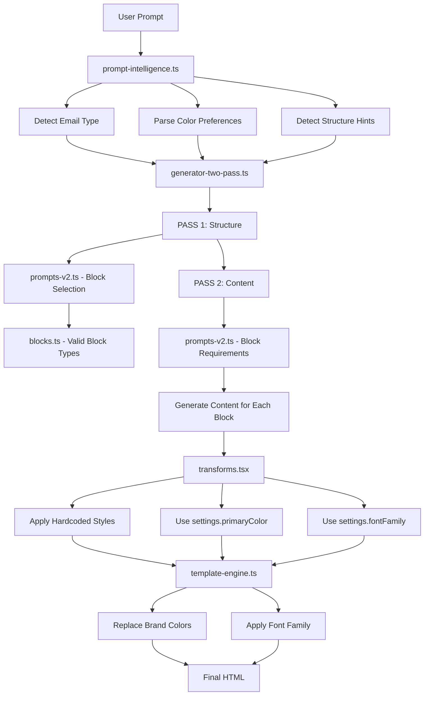

# AI Design Control Guide

## Overview
This document maps all code that controls which components, colors, and styles the AI generates for emails.

---

## 1. Component Selection (What Blocks the AI Uses)

### `/lib/email-v2/ai/blocks.ts` - Block Type Definitions
**Purpose:** Defines all 25 semantic block types the AI can generate.

**Available Block Types:**
- `hero` - Full-width header with headline, CTA, and image
- `features` - Grid of 2-4 features with icons/images
- `cta` - Call-to-action section with button
- `footer` - Company info, links, unsubscribe
- `testimonial` - Customer quote with author info
- `content` - Text paragraphs with optional images
- `list` - Numbered/bulleted list with items
- `article` - Blog post with author
- `articles` - Multiple article cards
- `gallery` - Image grid (2-6 images)
- `stats` - Key metrics display
- `pricing` - Pricing table/cards
- `ecommerce` - Product showcase
- `marketing` - Bento grid layout
- `header` - Logo and navigation
- `feedback` - Surveys/ratings
- `heading` - Simple headings
- `text` - Plain text
- `link` - Hyperlinks
- `buttons` - Button groups
- `image` - Single image
- `avatars` - User avatar display
- `code` - Code blocks
- `markdown` - Markdown content

**Key Schema Properties:**
```typescript
// Each block has:
- blockType: 'hero' | 'features' | ... 
- variant: specific layout variant
- content fields with character limits
- imageKeyword for AI image search
```

**Control Points:**
- Line 14-23: `HeroBlockSchema` - Controls hero structure
- Line 29-42: `FeaturesBlockSchema` - Controls feature grid options
- Line 425-450: `SemanticBlockSchema` - Master discriminated union

---

### `/lib/email-v2/ai/prompts-v2.ts` - Block Selection Prompts
**Purpose:** Guides which blocks to use for different email types.

**System Prompt (Lines 19):**
```typescript
export const SEMANTIC_GENERATION_SYSTEM_PROMPT = `
Semantic email JSON. 
previewText≤140. 
headline≤100. 
...
Brand:{primaryColor},{fontFamily}.
`;
```

**Block Recommendations by Email Type (Lines 42-96):**
- **Marketing:** `hero + features(icons-2col) + gallery + pricing + cta`
- **Product Launch:** `hero + features + gallery + testimonial + pricing + cta + footer`
- **Sale/Promotion:** `hero + ecommerce(grid) + stats + cta + footer`
- **Welcome:** `hero(split) + features(numbered) + cta`
- **Transactional:** `content + list(numbered) + cta + footer` (max 1-2 blocks)
- **Newsletter:** `hero + article(image-right|two-cards) + list + content + footer`

**Variant Guidance (Lines 122-162):**
Maps each block type to available layout variants:
```typescript
{
  hero: 'simple|centered|split',
  features: 'list-items|numbered-list|four-paragraphs|...',
  testimonial: 'simple-centered|large-avatar',
  // ... etc
}
```

---

### `/lib/email-v2/ai/generator-two-pass.ts` - Two-Pass Generation Logic
**Purpose:** Orchestrates AI generation in 2 passes (structure → content).

**Pass 1 - Structure Generation (Lines 67-216):**
- AI decides which blocks to use
- AI defines purpose for each block
- System prompt: Lists all 25 available block types

**Pass 2 - Content Generation (Lines 361-439):**
- AI generates actual content for each block
- Uses block-specific requirements (character limits)
- Ultra-compact prompts to save tokens

**Block Requirements (Lines 334-356):**
```typescript
{
  hero: `h≤100,sub≤150,cta≤40,url,img≤60`,
  features: `h≤100,sub≤150,f[3-4]:t≤60,d≤100,img≤60`,
  cta: `h≤100,sub≤150,btn≤40,url`,
  footer: `company,unsub`,
  // ... etc
}
```

---

### `/lib/email-v2/ai/prompt-intelligence.ts` - Intent Detection
**Purpose:** Analyzes user prompts to extract preferences before AI generation.

**Email Type Detection (Lines 16-114):**
- Keywords → email type classification
- `detectEmailType()` returns `'marketing' | 'transactional' | 'newsletter'`

**Structure Hints Detection (Lines 334-424):**
- Detects grid layouts: "4x3 grid" → `{ columns: 4, rows: 3 }`
- Detects item counts: "5 products" → `{ itemCount: 5 }`
- Detects needs: "logo", "table", "menu"

---

## 2. Color Selection (What Colors the AI Uses)

### `/lib/email-v2/types.ts` - Global Settings
**Purpose:** Defines the brand color structure.

**GlobalEmailSettings Interface (Lines 59-74):**
```typescript
{
  primaryColor: string;      // Main brand color (buttons, CTAs)
  secondaryColor?: string;   // Optional accent color
  fontFamily: string;        // Default font
  maxWidth: string;          // Email width
  backgroundColor?: string;  // Body background
}
```

---

### `/lib/email-v2/ai/prompt-intelligence.ts` - Color Parsing
**Purpose:** Extracts color preferences from natural language.

**Color Detection (Lines 124-236):**
- Parses: "blue background", "red buttons", "dark theme"
- Maps names to hex: `'forest green' → '#228B22'`
- Detects hex codes: `#4f46e5`, `#7c3aed`

**Supported Color Names (Lines 148-236):**
- Greens, blues, purples, reds, oranges, yellows, pinks, grays
- Theme keywords: "dark", "light", "vibrant", "muted", "pastel"

---

### `/lib/email-v2/template-engine.ts` - Color Application
**Purpose:** Applies brand colors to generated HTML.

**applyGlobalSettings() (Lines 219-268):**
```typescript
// Only replaces button/CTA backgrounds (NOT text colors)
const brandColors = ['#4f46e5', '#7c3aed', '#6366f1', '#3b82f6'];

for (const brandColor of brandColors) {
  // Replace with user's primaryColor
  updated = updated.replace(
    new RegExp(`background-color:\\s*${brandColor}`),
    `background-color: ${settings.primaryColor}`
  );
}

// Text colors are NEVER changed
// Headlines stay black (#000000)
// Body text stays gray (#6b7280, #374151)
```

---

### `/lib/email-v2/ai/transforms.tsx` - Hardcoded Component Colors
**Purpose:** Defines default colors when transforming blocks to components.

**Hero Section (Lines 127-221):**
```typescript
// Hero background: uses primaryColor
backgroundColor: settings.primaryColor

// Hero headline: white
color: '#ffffff'

// Hero subheadline: light purple
color: '#e9d5ff'

// Hero CTA button: white background, primary color text
backgroundColor: '#ffffff'
color: settings.primaryColor
```

**Features Section (Lines 223-355):**
```typescript
// Features heading: dark gray
color: '#111827'

// Features subheading: gray
color: '#6b7280'

// Features background: white
backgroundColor: '#ffffff'
```

**CTA Section (Lines 642-723):**
```typescript
// CTA button styles:
- style='primary': primaryColor background, white text
- style='secondary': #374151 background, white text
- style='outline': transparent background, primaryColor text/border
```

**Footer Section (Lines 725-866):**
```typescript
// Footer background: light gray
backgroundColor: '#f9fafb'

// Footer text: gray
color: '#6b7280'

// Footer borders: light gray
borderTop: '1px solid #e5e7eb'
```

**Color Constants Used Throughout:**
- Headlines: `#111827` (nearly black)
- Body text: `#374151`, `#6b7280` (grays)
- Backgrounds: `#ffffff` (white), `#f9fafb` (light gray)
- Borders: `#e5e7eb` (light gray)

---

## 3. Style Selection (Typography, Spacing, Layout)

### `/lib/email-v2/ai/prompts-v2.ts` - Design System Rules
**Purpose:** Defines design standards in the system prompt.

**Typography Hierarchy (Line 19):**
```text
Hero h1: 56-64px/800
Headers: 36-40px/700
Body: 17-18px/400
```

**Spacing System:**
```text
8px grid
Hero: 80px padding
Sections: 40-48px padding
```

**Button Specs:**
```text
Buttons ≥44px (min touch target)
```

---

### `/lib/email-v2/ai/transforms.tsx` - Component Styles
**Purpose:** Applies exact styles when creating React Email components.

**Hero Heading (Lines 134-142):**
```typescript
{
  fontSize: '42px',
  fontWeight: 700,
  lineHeight: '1.2',
  margin: '0 0 16px 0',
  textAlign: 'center',
  fontFamily: settings.fontFamily,
}
```

**Hero Subheading (Lines 152-160):**
```typescript
{
  fontSize: '18px',
  lineHeight: '1.5',
  margin: '0 0 32px 0',
  textAlign: 'center',
}
```

**Hero CTA Button (Lines 194-205):**
```typescript
{
  padding: '16px 40px',
  borderRadius: '8px',
  fontSize: '16px',
  fontWeight: 600,
  textDecoration: 'none',
  display: 'inline-block',
}
```

**Hero Section Padding (Lines 213-217):**
```typescript
{
  backgroundColor: settings.primaryColor,
  padding: '60px 24px',
  textAlign: 'center',
}
```

**Features Heading (Lines 230-239):**
```typescript
{
  fontSize: '32px',
  fontWeight: 700,
  margin: '0 0 16px 0',
  textAlign: 'center',
}
```

**Features Grid Layout (Lines 263):**
```typescript
const columnWidth = 
  featureCount === 2 ? '50%' : 
  featureCount === 3 ? '33.33%' : '25%';
```

**List Item Numbered Circle (Lines 419-430):**
```typescript
{
  width: '24px',
  height: '24px',
  borderRadius: '50%',
  backgroundColor: settings.primaryColor,
  color: '#ffffff',
  fontSize: '12px',
  fontWeight: 600,
  lineHeight: '24px',
  textAlign: 'center',
}
```

**Testimonial Quote (Lines 1298-1308):**
```typescript
{
  fontSize: '20px',
  fontStyle: 'italic',
  lineHeight: '1.6',
  margin: '0 0 24px 0',
  textAlign: 'center',
}
```

---

### `/lib/email-v2/template-wrapper.ts` - Email Container
**Purpose:** Creates the outer HTML structure with base styles.

**Body Styles (Lines 31-37):**
```typescript
{
  fontFamily: settings.fontFamily,
  backgroundColor: settings.backgroundColor || '#ffffff',
  margin: 0,
  padding: 0,
}
```

**Container Styles (Lines 43-47):**
```typescript
{
  maxWidth: settings.maxWidth,
  margin: '0 auto',
}
```

---

### `/lib/email-v2/templates/` - HTML Templates
**Purpose:** Pre-built HTML templates with inline styles.

**Example: `/templates/hero/simple.html`**
- Hardcoded styles for hero sections
- Uses placeholders like `{{headline}}`, `{{subheadline}}`
- Background colors, paddings, font sizes all defined

**Example: `/templates/features/numbered-list.html`**
- Numbered circle styles
- Grid layouts
- Feature card spacing

**Template Mappings: `/template-mappings/*.ts`**
- Maps semantic block data to template placeholders
- Defines which elements are repeating (features, products, etc.)
- Specifies default images/fallbacks

---

## 4. How to Change AI Choices

### To Change Available Block Types:
1. **Add new block schema** in `/lib/email-v2/ai/blocks.ts`
2. **Add to discriminated union** at line 425
3. **Add transform function** in `/lib/email-v2/ai/transforms.tsx`
4. **Add to prompts** in `/lib/email-v2/ai/prompts-v2.ts` line 14

### To Change Default Colors:
1. **Hardcoded colors:** Edit `/lib/email-v2/ai/transforms.tsx` lines 127-1768
2. **Brand color replacement:** Edit `/lib/email-v2/template-engine.ts` lines 235-244
3. **Color parsing:** Edit `/lib/email-v2/ai/prompt-intelligence.ts` lines 148-236

### To Change Typography/Spacing:
1. **System prompt rules:** Edit `/lib/email-v2/ai/prompts-v2.ts` line 19
2. **Component styles:** Edit `/lib/email-v2/ai/transforms.tsx` individual components
3. **HTML templates:** Edit files in `/lib/email-v2/templates/*/`

### To Change Block Selection Logic:
1. **Email type guidance:** Edit `/lib/email-v2/ai/prompts-v2.ts` lines 42-96
2. **Variant mapping:** Edit `/lib/email-v2/ai/prompts-v2.ts` lines 122-162
3. **Structure detection:** Edit `/lib/email-v2/ai/prompt-intelligence.ts` lines 334-424

---

## 5. Key Control Points Summary

| What You Want to Change | Primary File | Line Range |
|-------------------------|--------------|------------|
| Available block types | `blocks.ts` | 14-450 |
| Which blocks for email types | `prompts-v2.ts` | 42-96 |
| Block variants | `prompts-v2.ts` | 122-162 |
| Character limits | `generator-two-pass.ts` | 334-356 |
| Default colors (hardcoded) | `transforms.tsx` | 127-1768 |
| Brand color application | `template-engine.ts` | 219-268 |
| Color name parsing | `prompt-intelligence.ts` | 148-236 |
| Typography rules | `prompts-v2.ts` | 19 |
| Component typography | `transforms.tsx` | 127-1768 |
| Spacing values | `transforms.tsx` | 127-1768 |
| Layout calculations | `transforms.tsx` | 263, 419 |
| Email structure | `template-wrapper.ts` | 16-54 |
| Intent detection | `prompt-intelligence.ts` | 16-704 |

---

## 6. AI Decision Flow



---

## 7. Example: Changing Hero Button Padding

**Current:** `padding: '16px 40px'`

**To change to 20px vertical padding:**

1. Edit `/lib/email-v2/ai/transforms.tsx`
2. Find line ~196: `padding: '16px 40px'`
3. Change to: `padding: '20px 40px'`
4. Save and restart server

**OR** if using HTML templates:

1. Edit `/lib/email-v2/templates/hero/simple.html`
2. Find: `style="padding: 16px 40px;"`
3. Change to: `style="padding: 20px 40px;"`

---

## 8. Example: Adding a New Block Type

**To add a "Quiz" block:**

1. **Define schema** in `/lib/email-v2/ai/blocks.ts`:
```typescript
export const QuizBlockSchema = z.object({
  blockType: z.literal('quiz'),
  question: z.string().max(200),
  answers: z.array(z.string().max(100)).min(2).max(4),
  variant: z.enum(['simple', 'buttons']).default('simple'),
});
```

2. **Add to union** (line 425):
```typescript
export const SemanticBlockSchema = z.discriminatedUnion('blockType', [
  // ... existing blocks
  QuizBlockSchema,
]);
```

3. **Add transform** in `/lib/email-v2/ai/transforms.tsx`:
```typescript
case 'quiz':
  return createQuizSection(block, settings);
```

4. **Add to prompts** in `/lib/email-v2/ai/prompts-v2.ts` (line 14):
```typescript
export const STRUCTURE_GENERATION_SYSTEM_PROMPT = `
Email structure only. previewText ≤140 chars. 
2-12 blocks: header,hero,heading,text,features,...,quiz,footer.
`;
```

5. **Add variant guidance** (line 122):
```typescript
const g: Record<string, string> = {
  // ... existing
  quiz: 'simple|buttons',
};
```

---

## 9. File Dependency Map

```
prompts-v2.ts
├─ Used by: generator-two-pass.ts (Pass 1 & 2)
└─ Controls: Block selection, variants, design rules

blocks.ts
├─ Used by: generator-two-pass.ts (validation)
└─ Controls: Block types, schemas, character limits

prompt-intelligence.ts
├─ Used by: generator-two-pass.ts (preprocessing)
└─ Controls: Email type, colors, structure hints

generator-two-pass.ts
├─ Uses: prompts-v2.ts, blocks.ts, prompt-intelligence.ts
├─ Outputs: SemanticBlock[]
└─ Controls: 2-pass orchestration

transforms.tsx
├─ Uses: blocks.ts (types)
├─ Inputs: SemanticBlock[]
├─ Outputs: EmailComponent[]
└─ Controls: Hardcoded styles, colors, layouts

template-engine.ts
├─ Uses: templates/*.html, template-mappings/*.ts
├─ Inputs: SemanticBlock[] + GlobalSettings
├─ Outputs: HTML string
└─ Controls: Brand color replacement

template-wrapper.ts
├─ Uses: types.ts (GlobalEmailSettings)
├─ Outputs: EmailComponent (wrapper)
└─ Controls: Container, body styles

renderer.ts
├─ Uses: EmailComponent, template-wrapper.ts
├─ Outputs: Final HTML
└─ Controls: React Email rendering
```

---

## 10. Quick Reference: Common Tasks

### Change button colors:
- File: `transforms.tsx` lines 194-205, 690-709
- OR: `template-engine.ts` lines 235-244 (brand color mapping)

### Change headline sizes:
- File: `transforms.tsx` lines 134-142 (hero), 230-239 (features)
- OR: `prompts-v2.ts` line 19 (system prompt rules)

### Add new email type:
- File: `prompt-intelligence.ts` lines 16-114
- File: `prompts-v2.ts` lines 42-96 (add guidance)

### Change default spacing:
- File: `transforms.tsx` (padding values throughout)
- OR: `prompts-v2.ts` line 19 (8px grid rule)

### Add new color name:
- File: `prompt-intelligence.ts` lines 148-236

### Change character limits:
- File: `generator-two-pass.ts` lines 334-356
- OR: `blocks.ts` (Zod schema max values)

---

This guide provides a complete map of all files controlling AI component, color, and style decisions.


